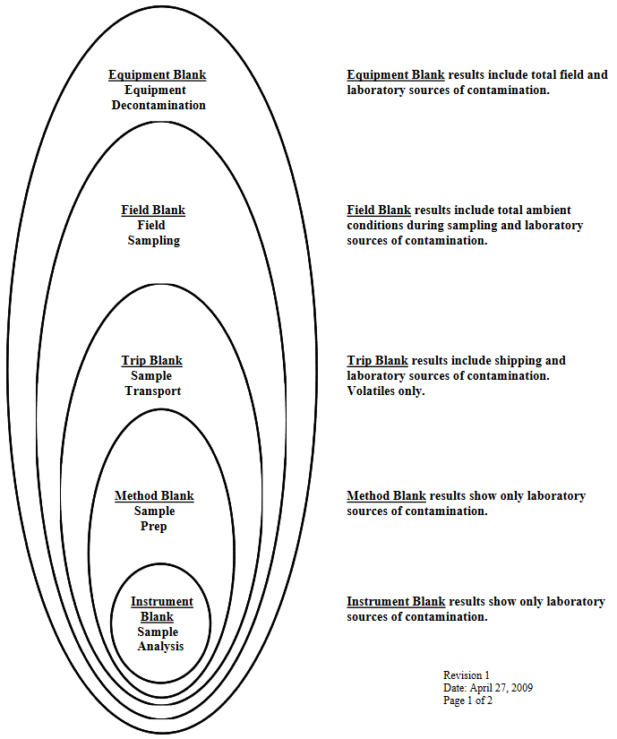

```{r setup, include=FALSE}
knitr::opts_chunk$set(echo = T, warning = F, message = F)

# https://readxl.tidyverse.org/
library(tidyverse)
library(readxl)
library(DT)
```

---

# Resources
- [execSQL](https://execsql.osdn.io/)
- [PostgreSQL Tutorial](https://www.postgresqltutorial.com/)
- [PostgreSQL Tips](https://pgdash.io/blog/postgres-tips-and-tricks.html?)

---

# Data Handling

## Summarization

1.  Average across lab replicates<br>
2.  Average across multiple analyses (if they exist) for the same lab sample. This will average across multiple methods and reanalyses (different SDGs)<br>
3.  Average across multiple lab samples (if they exist) for the same sample number (split) and lab.  Multiple lab samples may exist for the same sample number if the laboratory has created new laboratory sample IDs for reanalyses.<br>
4.  Average across multiple splits (if they exist) for the same lab and interpretive sample. Multiple sample numbers (splits) may exist for the same lab, or the same sample  number may exist for different labs. Splits sent to different labs potentially have an additional source of variability in addition to variability between splits sent to the same lab.<br>
5.  Average across laboratories for the same main sample. This summarizes data by main sample (sample_id), which is typically the lowest level of data summarization to be used for data interpretation.


## Character Encoding

We deal with character encoding issues when importing data to databases all the time.  All databases are encoded in UTF-8, and the most common non-ASCII, non-UTF-8 format is Microsoft's custom encoding, which is CP-1252 (also known as win-1252 and a few other things).  The character encoding of a file can't necessarily be definitively determined by examination, but the Linux command-line tool file generally does a good job.  (It's available on the "rstudio" server.)  Also, the Geany editor does a good job of diagnosing file formats.  If you want to change the encoding of a file rather than importing it in a known format, the Linux command-line tool iconv will do that for you.  There's a Python library on PyPI named chardet that will also diagnose file encodings.

For data managers, the workflow is to first guess that encoding errors on data import are due to the file being cp-1252.  That covers about 90% of cases.  Our import tool also automatically diagnoses instances where a file starts with a byte order mark (BOM), which covers most of the rest of the cases.  For the remainders, Geany is usually the quickest way to check the file encoding.

Everything that comes out of our databases is always in UTF-8, so I, at least, don't ordinarily have encoding issues when importing data to R.  For those who use data from other sources, it is a good idea to document a recommended workflow and set of tools.

---

# Chemistry

## Resources
- [Substance Registry Service](https://iaspub.epa.gov/sor_internet/registry/substreg/LandingPage.do)
- [Data Verification and Validation](https://www.epa.gov/sites/production/files/2015-06/documents/g8-final.pdf)
- [Data Qualifiers](https://apps.ecology.wa.gov/eim/help/ValidValues/DataQualifiers)
- [Data Review](https://www.epa.gov/clp/superfund-clp-national-functional-guidelines-data-review)
- [EIM Valid Values](https://apps.ecology.wa.gov/eim/help/ValidValues)
- [Chemical Lists](./static/Chemical_Lists.xls)
- [PCBs](https://www.epa.gov/pcbs/learn-about-polychlorinated-biphenyls-pcbs)


```{r, include=F}
wb <- "./static/Chemical_Lists.xls"

# chem_lists <- read_excel(wb, sheet=1)
# cwa <- read_excel(wb, sheet=2)
# pfas <- read_excel(wb, sheet=3)
# pesticides <- read_excel(wb, sheet=4)
pcb <- read_excel(wb, sheet=5)
# pah <- read_excel(wb, sheet=6)
# fertilizers <- read_excel(wb, sheet=7)
dioxfuran <- read_excel(wb, sheet=8)
# pbde <- read_excel(wb, sheet=9)
```

## Dioxin & Furans
[Resource](https://www.eurofins.com/media/312559/dioxine_ts_eng.pdf)
```{r}
datatable(dioxfuran, options=list(scrollX=T))
```

<!-- ## PAHs -->
```{r, eval=F}
datatable(pah, options=list(scrollX=T))
```

## PCBs
```{r}
datatable(pcb, options=list(scrollX=T))
```

<!-- ## PFAS -->
```{r, eval=F}
datatable(pfas, options=list(scrollX=T))
```

---

# Lab Data

* [https://pubs.usgs.gov/wdr/WDR-WA-03-1/pdf/ADR_N.pdf](https://pubs.usgs.gov/wdr/WDR-WA-03-1/pdf/ADR_N.pdf)
* [http://www.eccsmobilelab.com/resources/literature/?Id=117](http://www.eccsmobilelab.com/resources/literature/?Id=117)
* [Conversions](./static/EFH-REFS_CHPT10.pdf)


## R tool
[OrgMassSpecR](https://www.rdocumentation.org/packages/OrgMassSpecR/versions/0.5-3/topics/ConvertConcentration)
```{r, class.source='fold-show'}
# install.packages("OrgMassSpecR")
library(OrgMassSpecR)
ConvertConcentration(0.031, "wet.to.lipid", 95)
```

## Measurement Basis

### Wet Weight
> Wet weight (or as-is) basis means no calculation has been made to compensate for the moisture content of a sample. Wet weight refers to the weight of animal tissue or other substance including its contained water. (See also “Dry weight”)

### Dry Weight
> Dry weight basis means the lab has measured moisture content of a sample and calculated concentrations based on the percent solids present. Dry weight refers to the weight of animal tissue after it has been dried in an oven at 65°C until a constant weight is achieved. Dry weight represents total organic and inorganic matter in the tissue. (See also “Wet weight”).

### Lipid
> Lipid is any one of a family of compounds that are insoluble in water and that make up one of the principal components of living cells. Lipids include fats, oils, waxes, and steroids. Many environmental contaminants such as organochlorine pesticides are lipophilic.

---

## Conversions

### Wet to Dry
$$DryWt = \frac{WetWt}{Percent Solids} * 100$$

### Dry to Wet
$$WetWt = \frac{DryWt * PercentSolids}{100}$$
<center>**DryWt & WetWt** = concentration<br>
**PercentSolids** = percentage (no decimal)</center>

### Resource
<center>

</center>


## Analytical Blanks

### Trip Blank
The trip blank is designed to identify levels of contamination from the exposure of the reagent or sorbent bed to the same atmospheres exposed to the analyte reagent or sorbent bed.  The trip blank is prepared in the laboratory with the other reagents or adsorbents prior to shipping to the field.  However, the trip blank is never exposed to the field atmospheres.  It is simply sent along with the field samples to and from the site.  The trip blank identified areas of exposure such as shipping temperatures and pressures, laboratory preparation of field samples and laboratory preparation of field samples for analysis.

### Field Blank
The field blank is similar to the trip blank in that it is also prepared during the preparation of the field reagents or adsorbents.  However, the field blank is exposed to the same atmospheres in the field as the field samples.  This means that the field blank is opened during the charging of impingers or sorbents in the sample train.  The field blank is also exposed during the exchanging of cartridges in SW-846, Method 0030 or when field reagents are being exchanged during a test run.  In summary, field blanks consist of additional sample collection media (e.g., sorbent tubes, reagents, filters) which are transported to the monitoring site, exposed briefly at the site when the samples are exposed (but no stack gas is actually pulled through these blanks), and transported back to the laboratory for analysis, similar to a field sample.  At least one field blank should be collected and analyzed for each test series.

### Laboratory Blank
The laboratory blank is a sample of the reagents or sorbents used during the sample train reagent preparation or recovery.  The laboratory blank is a sample of the extraction solvent, the rinses used during sample recovery, or a sample from the batch of sorbent used to preparing sampling cartridges.  Laboratory blanks include both method blanks and instrument blanks.  Method blanks are carried through all steps of the measurement process (from extraction through analysis).  A method blank is typically analyzed with each sample batch.  Instrument blanks are used to demonstrate that an instrument system is free of contamination.  Instrument blanks are typically analyzed prior to sample analysis and following the analysis of highly contaminated samples.

### Reagent Blank
The reagent blank is a sample of the solvents used during recovery of the sample train after the test is completed.  You recall, reagent blanks for both multi-metal and chromium +6 require that the reagent blank be the same volume as the renses used to recover the samples, from probe to impinger.  This is because the blank value is substracted from the sample to obtain a final concentration.

### Diagram



