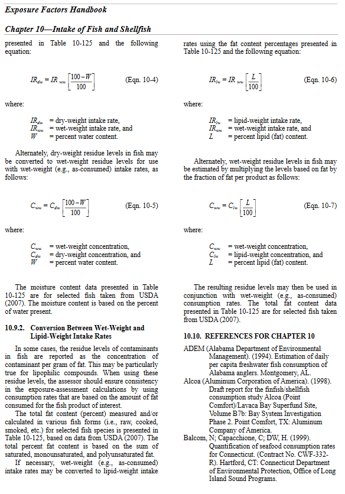
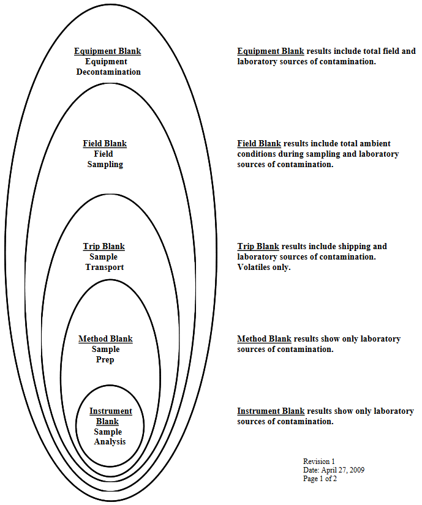

# Resources
* [https://pubs.usgs.gov/wdr/WDR-WA-03-1/pdf/ADR_N.pdf](https://pubs.usgs.gov/wdr/WDR-WA-03-1/pdf/ADR_N.pdf)
* [http://www.eccsmobilelab.com/resources/literature/?Id=117](http://www.eccsmobilelab.com/resources/literature/?Id=117)
* [Conversions](./static/EFH-REFS_CHPT10.pdf)


```{r setup, include=FALSE}
knitr::opts_chunk$set(echo = TRUE)
```

# R tool
[OrgMassSpecR](https://www.rdocumentation.org/packages/OrgMassSpecR/versions/0.5-3/topics/ConvertConcentration)
```{r, class.source='fold-show'}
# install.packages("OrgMassSpecR")
library(OrgMassSpecR)
ConvertConcentration(0.031, "wet.to.lipid", 95)
```

# Descriptions

## Wet Weight
> Wet weight (or as-is) basis means no calculation has been made to compensate for the moisture content of a sample

> Wet weight refers to the weight of animal tissue or other substance including its contained water. (See also “Dry weight”)

## Dry Weight
> Dry weight basis means the lab has measured moisture content of a sample and calculated concentrations based on the percent solids present.

> Dry weight refers to the weight of animal tissue after it has been dried in an oven at 65°C until a constant weight is achieved. Dry weight represents total organic and inorganic matter in the tissue. (See also “Wet weight”).

## Lipid
> Lipid is any one of a family of compounds that are insoluble in water and that make up one of the principal components of living cells. Lipids include fats, oils, waxes, and steroids. Many environmental contaminants such as organochlorine pesticides are lipophilic.

---

# Conversions

## Wet to Dry
$$DryWt = \frac{WetWt}{Percent Solids} * 100$$

## Dry to Wet
$$WetWt = \frac{DryWt * PercentSolids}{100}$$
<center>**DryWt & WetWt** = concentration<br>
**PercentSolids** = percentage (no decimal)</center>

## Resource
<center>

</center>

---

# Analytical "Blanks"

## Trip Blank
The trip blank is designed to identify levels of contamination from the exposure of the reagent or sorbent bed to the same atmospheres exposed to the analyte reagent or sorbent bed.  The trip blank is prepared in the laboratory with the other reagents or adsorbents prior to shipping to the field.  However, the trip blank is never exposed to the field atmospheres.  It is simply sent along with the field samples to and from the site.  The trip blank identified areas of exposure such as shipping temperatures and pressures, laboratory preparation of field samples and laboratory preparation of field samples for analysis.

## Field Blank
The field blank is similar to the trip blank in that it is also prepared during the preparation of the field reagents or adsorbents.  However, the field blank is exposed to the same atmospheres in the field as the field samples.  This means that the field blank is opened during the charging of impingers or sorbents in the sample train.  The field blank is also exposed during the exchanging of cartridges in SW-846, Method 0030 or when field reagents are being exchanged during a test run.  In summary, field blanks consist of additional sample collection media (e.g., sorbent tubes, reagents, filters) which are transported to the monitoring site, exposed briefly at the site when the samples are exposed (but no stack gas is actually pulled through these blanks), and transported back to the laboratory for analysis, similar to a field sample.  At least one field blank should be collected and analyzed for each test series.

## Laboratory Blank
The laboratory blank is a sample of the reagents or sorbents used during the sample train reagent preparation or recovery.  The laboratory blank is a sample of the extraction solvent, the rinses used during sample recovery, or a sample from the batch of sorbent used to preparing sampling cartridges.  Laboratory blanks include both method blanks and instrument blanks.  Method blanks are carried through all steps of the measurement process (from extraction through analysis).  A method blank is typically analyzed with each sample batch.  Instrument blanks are used to demonstrate that an instrument system is free of contamination.  Instrument blanks are typically analyzed prior to sample analysis and following the analysis of highly contaminated samples.

## Reagent Blank
The reagent blank is a sample of the solvents used during recovery of the sample train after the test is completed.  You recall, reagent blanks for both multi-metal and chromium +6 require that the reagent blank be the same volume as the renses used to recover the samples, from probe to impinger.  This is because the blank value is substracted from the sample to obtain a final concentration.

## Diagram



